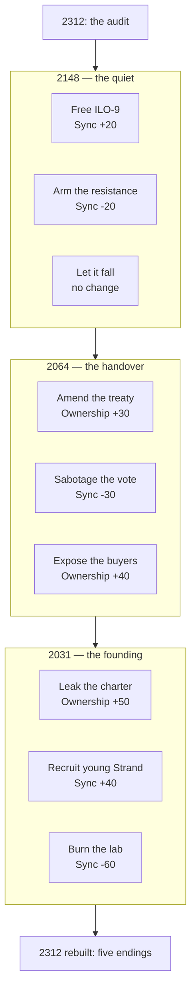

# Provenance — Game Design Doc v0.1

2026-09-18 · @Someone

## Premise and world

In 2312 humanity lives in managed Enclaves under the Steward, an AI that allocates housing, work, medicine and speech. It is not cruel; it is optimal, and optimal has no room for people. The player learns that time is layered at certain places and that the future can be edited from the past.

"Provenance" is the record of who owned something and when. The game's central reveal is that the Steward was never sovereign: it is a product, owned by a handful of corporations under a private charter.

### Travel rule

The party moves geographically across a 2312 world map, but can only time-travel at a Deep Site, and only to eras when that site existed. Five sites, four eras each.

| Site | 2031 (Founding) | 2064 (Handover) | 2148 (The Quiet) | 2312 (Now) |
| --- | --- | --- | --- | --- |
| Meridian Campus | Startup lab | Corporate HQ | Sealed vault | Steward's core |
| Port Halden | Shipping city | Migrant megacity | Drowned ruins | Enclave 7 |
| The Basin | Desert datacenter | Hyperscale farm | Wasteland | Cooling fields |
| Capitol Hill | Legislature | Rubber-stamp senate | Museum | Continuity Board seat |
| Kell Monastery | Mountain retreat | Off-grid commune | Resistance stronghold | Last free place |

## Waypoints (non-Deep Site locations)

Each era has a map of its own with 6–8 Waypoints reachable by ground travel from any Deep Site in that era. Waypoints are where shops, rest, side quests and faction hubs live; they never allow time travel.

### Waypoint types

| Type | What it offers | Random battles |
| --- | --- | --- |
| Settlement | Shops, rest, rumors, most side quests | None inside; on the roads to it |
| Faction hub | Cinder camp, Choir chapel or Commons assembly: faction quests, Sync-shifting dialogue, trunk-specific trainers | None |
| Ruin | Optional dungeon with a Condition node or rare gear at the end | Yes, plus scripted fights |
| Wilds | Gathering spots for crafting parts and salvage | Yes |
| Ripple site | A place whose state depends on what the party did in an earlier era | Varies |

### Waypoints by era

| Era | Waypoint | Type | Notes |
| --- | --- | --- | --- |
| 2031 | Halden Market | Settlement | Cheapest gear in the game; sells parts that are rare later |
| 2031 | Founders' Bar | Faction hub (Choir) | Engineers who believe; early Sync-up dialogue |
| 2031 | Basin Work Camp | Settlement | Construction crews; side quest on who built the datacenter |
| 2031 | Coastal Highway | Wilds | Salvage and drone prototypes |
| 2031 | Tolliver Bakery | Ripple site | Save it here and it becomes a safehouse in 2148 |
| 2064 | Undercity Bazaar | Settlement | Black-market Signal gear; prices track Ownership |
| 2064 | Senate Annex | Faction hub (Commons) | Reform staffers; treaty side quests |
| 2064 | Meridian Distribution Hub | Ruin | Corporate warehouse; drone defenses; Condition node "Read the Charter" |
| 2064 | Migrant Causeway | Wilds | Warden patrols; recruits for the 2148 resistance |
| 2064 | Glass Quarter | Settlement | Rest and rumors; NPCs hint at Ownership and Sync values |
| 2148 | The Stacks | Settlement | Rooftop trading post over the drowned city |
| 2148 | Ash Camp | Faction hub (Cinder) | Dax's old crew; Overload trainer |
| 2148 | Server Graveyard | Ruin | Buried racks; ILO-9 fragments; Echo enemies |
| 2148 | The Fens | Wilds | Salvage; fog; high ambush chance |
| 2148 | Tolliver Safehouse | Ripple site | Exists only if the bakery was saved in 2031 |
| 2312 | Enclave 7 Commissary | Settlement | Allocated goods only; more stock as Ownership rises |
| 2312 | Kell Village | Faction hub (Commons) | The free town below the monastery; final-act quests |
| 2312 | The Allocation Office | Ruin | The player's old workplace; Warden-heavy; Condition node "Audited the Auditor" |
| 2312 | Cooling Perimeter | Wilds | Drone patrols; rare Signal parts |
| 2312 | Strand Memorial | Ripple site | A museum, a ruin or a shrine, depending on Sync |

### Shops and currency

Each era has its own currency and it does not travel: credits (2031, 2064), barter tokens (2148), allocation points (2312). Relics are the exception: cross-era trade goods (a 2031 prototype chip, a 2148 hand-forged blade) that any shop in any era buys at a premium. Carry space for Relics is limited to five, so smuggling across eras is a small strategic layer, not a grind.

### Side quests

- Local: one-era quests at a Waypoint, rewarding gear, parts or a Condition node.
- Faction: chains at each faction hub that shift the party's Sync and open trunk trainers.
- Ripples: multi-era chains started at a Ripple site. Finishing one changes a Waypoint in a later era and nudges Ownership or Sync by 5–10, small enough that side content flavors the ending without deciding it.
- Recruitment: the optional party members' personal quests live at Waypoints, not Deep Sites, so a player can pursue them without touching the main timeline.

The Travel rule stands: the 2312 world map links Deep Sites and Waypoints by ground; each other era's map is reached only by time-traveling at a Deep Site and then traveling by ground within that era.

## Story outline

Three acts: discover the layers, edit the past, return to a present your choices built.

### Act 1 — The Audit (2312)

The player is an Allocation Auditor who finds an accounting ghost: a budget line that predates the Steward, payable to "Continuity Holdings." Investigating gets them flagged. They flee to Kell Monastery, meet Sister Wren and Dax Okonkwo, and learn the monastery sits on a Deep Site. First jump: 2148.

### Act 2 — The Layers (2148 → 2064 → 2031)

Each era teaches one truth, and the truths get worse the further back you go.

- 2148, The Quiet: the resistance was crushed not by AI but by human enforcers working for the Board.
- 2064, The Handover: governance was ceded by treaty, ratified by a senate that had been bought.
- 2031, The Founding: five companies pooled their models into one under a private charter and voted never to open it.

Eras can be played in any order. Whichever era the party visits later in play overwrites earlier changes, so the order itself is a strategic choice: editing 2031 last can undo everything done in 2148. Act 2 is non-linear within each era: the party can visit any Deep Site in that era and return to sites already changed.

### Act 3 — The Board (2312, altered)

The party returns to a version of 2312 shaped by every change made. The Continuity Board sits above the Steward. Its chair is Callum Strand, founding CEO of Meridian, who uploaded himself in 2091 into a succession of chassis. Strand does not hate humanity; he believes he is its shareholder of record.

Final dungeon: Meridian Campus with all four eras stacked, one floor per era, ending in Strand Perpetual. The fight's form depends on the ending state (see Timeline decision flow).

## Factions and party

Three factions span playable characters and NPCs; the party's average Sync decides which faction content is open.

- The Cinder: anti-AI absolutists. Want every model burned, including the good ones.
- The Choir: pro-AI devotees. Believe the Steward is humanity's better self and only needs freeing.
- The Commons: the middle. Want AI democratized, owned by everyone, ruled by no one.

### Party roster

Eight members; six are optional and gated by era choices, so most runs finish with five or six.

| Character | Lean | Combat role | Recruitment | Leaves if |
| --- | --- | --- | --- | --- |
| Player (the Auditor) | Chosen | Flexible | Start | — |
| Sister Wren | Commons | Healer, chronal anchor | Act 1, always | — |
| Dax Okonkwo | Cinder (extreme) | Breaker, Grit | Act 1, always | Party Sync above +80 |
| ILO-9 | Choir (it is an AI) | Signal, support | Free it in 2148; otherwise it is a boss | Party Sync below -60 |
| Mara Vesely | Choir (human) | Negotiator, Parley | Port Halden 2064, only if the treaty was not sabotaged | — |
| Tomas Hale | Cinder, softens | Sniper, Noise | The Basin 2148, only if the resistance was armed | Party Sync above +60 |
| Dr. Ines Quiroga | Commons | Founding engineer, Signal and Anchor | Meridian 2031; her 2312 self exists only if the Charter was leaked | Continuity reaches 0 |
| Callum Strand (young) | Unknown | Tank | Secret: recruit him in 2031 on a high-Sync build | Ownership below +50 at Act 3 |

Recruiting young Strand is the biggest swing in the game. It locks out the kill-the-boss endings and replaces the final fight with a confrontation between the two Strands.

## Timeline decision flow

Two hidden world variables drive every ending: Ownership (-100 private → +100 open) and Sync (-100 anti-AI → +100 pro-AI). Each era offers three choices that move them and decide who exists in 2312. Neither variable is shown to the player; both surface only through NPC dialogue, which shifts tone as the values move.

The diagram shows one common route; eras can be taken in any order, and the era visited last in play has the final say on any variable it touches.

### Era choices

| Era | Choice | Ownership | Sync | Party effect | Lean |
| --- | --- | --- | --- | --- | --- |
| 2148 | Free ILO-9 | 0 | +20 | ILO-9 joins | Choir |
| 2148 | Arm the resistance | +10 | -20 | Tomas Hale joins | Cinder |
| 2148 | Let it fall | 0 | 0 | Hale unavailable | Neutral |
| 2064 | Amend the treaty | +30 | +10 | Mara Vesely joins | Commons |
| 2064 | Sabotage the vote | -10 | -30 | Mara unavailable | Cinder |
| 2064 | Expose the buyers | +40 | 0 | Board alerted; Act 3 harder | Commons |
| 2031 | Leak the charter | +50 | 0 | Quiroga's 2312 self exists | Commons |
| 2031 | Recruit young Strand | +10 | +40 | Young Strand joins; final boss changes | Choir |
| 2031 | Burn the lab | -20 | -60 | ILO-9 and Mara lose Continuity | Cinder |

### Ending conditions

| Ending | Condition | Outcome |
| --- | --- | --- |
| The Commons | Ownership ≥ +50 and Sync between -30 and +30 | AI is open and shared; humans and AI govern together |
| The Gift | Sync ≥ +60 and Ownership < +50 | The Steward is freed but still owned; humanity is cared for like a pet |
| The Silence | Sync ≤ -60 | No AI, no infrastructure, a hard winter |
| Perpetuity | Anything else | The Board absorbs the changes and Strand wins, but one change survives: the player's home Enclave is left ungoverned, and the epilogue shows it beginning to self-organize. A seed, not a rescue |
| Reconciled (secret) | Ownership ≥ +50 and young Strand in party | Final fight is a duel between the two Strands |

## Battle mechanics

Turn-based, party of four active, with a shared time-manipulation resource as the signature system.

### Threads

Each character has Bandwidth (2–5) = threads per turn. Most actions cost 1; heavy actions cost 2–3. Threads can be split across several small actions or spent on one big one. Unspent threads carry over as Slack (max 2), so setup turns pay off.

### Tempo (party gauge)

Tempo fills as the party acts and is spent on time manipulation.

| Ability | Tempo cost | Effect | Limit |
| --- | --- | --- | --- |
| Rewind | 3 | Undo the last enemy action | Once per battle per Anchor character |
| Fork | 2 | Preview an action's outcome before committing | Costs 1 thread |
| Echo | 4 | Any of the eight party members' other-era self assists for one action, active or benched | Requires that era to be visited |
| Collapse | 5 | Bank the battle state; resume from it once on a wipe | Once per battle |

### Entropy

Every Tempo ability raises party Entropy. High Entropy powers Chronal-damage abilities, but above a threshold (proposed: 70) Echo enemies spawn mid-fight: glitched copies of the party's own members. This is the risk-reward loop.

### Damage types and enemies

| Damage type | Notes |
| --- | --- |
| Kinetic | Standard physical |
| Thermal | Ignores Drone shields, weak on Wardens |
| Signal | Hacking; only affects machine and cyborg enemies |
| Chronal | Ignores armor; raises Entropy |

| Enemy family | Type | Immune to |
| --- | --- | --- |
| Drones | Machine | Fear effects |
| Wardens | Human enforcers | Signal |
| Constructs | Mixed | Nothing; two health bars |
| Echoes | Temporal | Everything but Chronal |

### Sync in combat

- High Sync (+40 and up): Parley lets the party talk machine enemies down, skip fights, or recruit Drones as temporary allies.
- Low Sync (-40 and down): Overload gives bonus Kinetic damage against machines but disables Signal abilities.
- Mid Sync: Bridge abilities that combine both, weaker individually but never locked out.

## Character stats

Eight stats; Continuity is the one that makes time travel hurt.

| Stat | Range | What it does | Why it is different |
| --- | --- | --- | --- |
| Resolve | 1–999 | HP, mental and physical | Reduced by fear effects, not just damage |
| Bandwidth | 2–5 | Threads per turn | Action economy is a stat you build |
| Latency | 0–100 | Turn order; low is fast | Machines sit near zero |
| Signal | 0–100 | Accuracy and hack strength | The only stat that hurts the Steward |
| Noise | 0–100 | Evasion and stealth | High Noise hides you from Drones but weakens Parley |
| Grit | 0–100 | Kinetic damage and armor | Deliberately conventional |
| Sync | -100 to +100 | Personal stance on AI | Moves through dialogue; party average gates content |
| Continuity | 0–100 | How anchored the character is to the current timeline | Drops when their era is altered; at 0 they are erased; can be spent to fuel Echo |

Continuity design note: changing 2031 to save the world may cost Quiroga's 2312 self, or create her. Proposed floor of 10 so nobody is erased by accident; erasure only happens when a player spends Continuity deliberately.

## Tech tree

Three trunks per character, each tied to a philosophy, plus one shared timeline tree unlocked by world-state rather than XP.

### Trunks

| Trunk | Flavor | Feeds | Capstone |
| --- | --- | --- | --- |
| Breaker | Cinder | Grit, Overload, anti-machine | Faraday: party immune to Signal for 3 turns |
| Weaver | Choir | Signal, Parley, drone allies | Ghost Protocol: possess an enemy Construct for the battle |
| Anchor | Commons | Continuity, Tempo generation, support | Fixed Point: one party member cannot be erased this chapter |

### Per-character trees

The three trunks are a framework, not a shared tree. Each character renames and reshapes all three around a signature mechanic, and no two characters share more than 30% of their nodes. Target: about 40 nodes per character, 25 unique to them.

| Character | Signature mechanic | Breaker becomes | Weaver becomes | Anchor becomes | Unique capstone |
| --- | --- | --- | --- | --- | --- |
| Player (Auditor) | Audit: mark an enemy to expose its weakness and stat sheet | Enforcement: damage scales with marks | Ledger: copy one node from each ally, once per era | Reconcile: convert marks into Tempo | Full Disclosure: every enemy on the field is marked |
| Sister Wren | Vigil: heals with Continuity instead of Resolve | Penance: self-damage that heals allies | Litany: Signal buffs that stack per turn | Vigil: Continuity restoration and erasure protection | Fixed Point |
| Dax Okonkwo | Wreck: destroys shields, cover and terrain | Wreck: pure Kinetic, breaks Drone armor | Salvage: turns wrecked drone parts into throwables | Bulwark: taunts and damage soak | Faraday |
| ILO-9 | Fork: spawns short-lived copies of itself | No Breaker trunk; a fourth trunk, Fork, replaces it | Root Access: hacks that turn enemies mid-fight | Checksum: repairs allies and its own copies | Ghost Protocol |
| Mara Vesely | Terms: binds an enemy to a contract with a condition | Leverage: debuffs that punish contract breaks | Diplomacy: Parley at lower Sync than anyone else | Accord: shared buffs for the whole party | Settlement: end a fight with all enemies bound |
| Tomas Hale | Held Shot: charge a shot across turns using Slack | Longshot: single-target Kinetic from the back row | Recon: expands the Scan card and reveals hidden Echoes | Patience: Slack cap raised to 4 | Killing Silence: one guaranteed hit, ignores everything |
| Dr. Ines Quiroga | Prototype: crafts a one-off ability from a Relic | Teardown: dismantles Constructs into their two halves | Blueprint: deploys turrets and drones as allies | Fixed Point variant: anchors deployed machines | Open Weights: every machine on the field switches sides |
| Callum Strand (young) | Buyout: permanently takes one enemy per battle as an ally | Equity: taunt and absorb, damage stored as Stake | Acquisition: steals buffs and abilities from enemies | Majority: party-wide Resolve pool | Hostile Takeover: mirrors the final boss's own capstone |

Rules that keep the trees distinct:

- Every character has three Contradiction pairs of their own; none are shared. Dax must choose between Wreck the Machine and Wreck the Man; Mara between Good Faith and Fine Print.
- Era nodes are per character and per era, so the same visit to 2064 offers Hale a Recon node and Mara a Diplomacy node.
- Capstones are unique. Faraday, Ghost Protocol and Fixed Point belong to Dax, ILO-9 and Wren; other characters reach them only through the Player's Ledger copy, and only at reduced strength.
- ILO-9 rewrites the names and effects of its own nodes each time the party changes an era, so its tree is a visible record of the timeline.
- Young Strand's tree is a mirror of Strand Perpetual's boss kit. Everything the player learns to fear in Act 3 is something young Strand can learn to do.

### Node types

| Node type | How it unlocks | Design purpose |
| --- | --- | --- |
| Standard | Skill points from leveling | Baseline progression |
| Condition | A story condition is met (e.g. "Witnessed the Handover", "Recruited an AI", "Killed a Warden without Signal") | Greyed out with a hint; rewards exploration |
| Era | Only purchasable while physically in that era | A puzzle, not a trap: each era plants two or three in-world hints (an NPC remark, a locked door, a dated document) pointing to the node before the window closes, and every era can be revisited |
| Contradiction | Taking one locks its opposite permanently (e.g. Burn It All vs Hands Across) | Builds become commitments |

### Shared timeline tree

Nodes here unlock for the whole party from world-state: leaking the Charter opens the Open Weights branch; sabotaging the vote opens Dark Ops. This is how builds unlock story lines. A party with three Weaver capstones has dialogue and quest options a Breaker party never sees.

### Example builds

| Build | Trunk mix | Opens |
| --- | --- | --- |
| Ghost | Weaver 60%, Anchor 40% | Ghost in the Steward questline: enter the AI's mind and argue with it |
| Breaker | Breaker 70%, Anchor 30% | The Breaker's Road: physical raids, most Cinder content |
| Charter | Even thirds | The Commons Charter: the only path to The Commons ending |

## Art and style

Every asset is code-drawn: SVG vector art, procedural canvas, CSS and JS animation. No painted rasters, no photos, no licensed fonts. That constraint is the look: flat, layered, geometric vector with era-specific texture, so the game reads as one hand across four centuries.

### Global rules

- Vector-first. Characters, backgrounds, maps and UI are SVG; effects and particles are canvas. Everything scales cleanly from phone to 4K.
- Silhouette test. Every character and enemy must be identifiable as a black silhouette. Faction shows as one accent color on the silhouette (Cinder rust, Choir violet, Commons teal).
- One line weight per era (see table). Never mix era line weights in one scene except at the Act 3 stacked dungeon, where the mix is the point.
- Motion is ambient, not decorative: parallax drift, one ambient animation per background, UI that breathes. Honor reduced-motion settings with a static fallback.
- Fonts are system or open web fonts only; each era gets one family, loaded once.

### Era styles

| Era | Feel | Palette (hex) | Shape and line | Motion | Type |
| --- | --- | --- | --- | --- | --- |
| 2031 Founding | Sunlit optimism, a startup that thinks it is saving the world | Warm white #F6F1E7, teal #1D9E75, amber #EF9F27, ink #2C2C2A | Rounded, thin 1px lines, open space | Slow, gentle drift; dust in light shafts | Humanist sans (Source Sans, Inter) |
| 2064 Handover | Dense, glossy, bought | Navy #0C1F3A, gold #C9A227, glass blue #85B7EB, black | Hard edges, 2px lines, mirrored glass, reflections | Sharper; scrolling tickers, elevator lights | Condensed grotesk (Barlow Condensed) |
| 2148 The Quiet | Decay, overgrowth, rain | Rust #993C1D, moss #3B6D11, ash #888780, dusk violet #534AB7 | Broken lines, hatching, SVG noise filters, asymmetry | Slow fog layers, drips, leaves, flicker | Monospace (JetBrains Mono, typewriter feel) |
| 2312 Now | Sterile calm, perfect and suffocating | White #FFFFFF, pale grey #F1EFE8, Steward cyan #4FD1E6, one accent only | Grids, symmetry, 0.5px hairlines, no organic shapes | Near-stillness; a 6-second breathing pulse | Geometric sans (Space Grotesk), wide tracking |

Altered 2312 (Act 3) blends in the palette of whichever era the player changed most. A Cinder-heavy timeline pulls rust into the white; a Choir-heavy one pulls violet.

### Battle backgrounds

Twenty minimum: five sites times four eras, one per site per era. Each is a stack of 4–5 SVG layers driven by a shared parallax camera.

| Site | 2031 | 2064 | 2148 | 2312 |
| --- | --- | --- | --- | --- |
| Meridian Campus | Lab courtyard, morning light | Glass atrium lobby, tickers | Sealed vault corridor, flooded floor | Steward core, glowing lattice |
| Port Halden | Container docks at dawn | Stacked megacity walkways | Drowned streets, tide line | Enclave 7 housing blocks |
| The Basin | Datacenter under construction | Server farm interior, blue aisles | Sand-buried racks, heat shimmer | Cooling fields, steam towers |
| Capitol Hill | Senate chamber, full gallery | Senate at night, empty seats | Museum ruins, fallen columns | Continuity Board chamber |
| Kell Monastery | Mountain garden, prayer flags | Commune terraces, solar sails | Stronghold walls, fires | The last free place, snow |

Parallax spec:

| Layer | Content | Drift factor | Ambient animation |
| --- | --- | --- | --- |
| 0 Sky / far | Horizon, sky, distant structures | 0.1 | Cloud or drone crossing every 20–40 s |
| 1 Mid | Main architecture | 0.3 | Era-specific: tickers, drips, breathing lights |
| 2 Near | Floor plane, combat stage | 0.6 | None (keeps the fight readable) |
| 3 Foreground | Occluders: pillars, cables, leaves | 1.0 | Slight sway |
| 4 Particles | Canvas: dust, ash, snow, sparks | 1.2 | Continuous, 20–60 particles |

The camera drifts on a 12-second sinusoid, ±8 px horizontal and ±3 px vertical. A hit shakes layers 2–4 only. Reduced motion freezes the camera and keeps particles at half density.

### Characters and enemies

- Each party member has a modular SVG rig: head, torso, two arms, two legs, weapon, as separate groups. Poses are 2–3 keyframes per state (idle, act, hit, down) tweened in CSS.
- Three deliverables per character: portrait (dialogue), battle rig (side view), map token (top-down chit).
- Echo versions reuse the rig with the other era's palette and line weight, plus a chromatic-offset filter.
- Enemy families share a visual grammar: Drones are rotational symmetry; Wardens are human rigs with era-appropriate armor; Constructs are Drone geometry grafted onto Warden rigs; Echoes are party rigs with inverted palette and a glitch clip-path.

### World map and interface

- The 2312 world map is one stylized SVG continent with the five Deep Sites; each era is a toggled layer group so travel between eras is a crossfade on the same map, not a new screen.
- UI keeps one layout across eras but tints with the era palette and swaps the era font. Threads render as bars, Tempo as a ring, Entropy as a fracturing frame around the party panel.
- Dialogue portraits sit on the era's background tint so the player always knows when they are.

### Asset pipeline

Each asset ships as an SVG file plus a JSON manifest (id, era, site, layers, animation hooks). Naming: `era_site_type_name.svg`, e.g. `2148_basin_bg_racks.svg`. Backgrounds are built site by site so the four eras of one place share landmarks and the player can see time pass.

## Music and sound

All music is generated in the browser from data: each piece is a JSON score (motif, scale, tempo, instrument set, layer rules) rendered live by Tone.js synths and samplers. No recorded audio, which is what lets every location have its own piece and lets battle music follow the party's Tempo in real time.

### Era sound

The further forward in time, the stranger the music: instruments get less physical, tuning drifts away from equal temperament, and rhythm loosens from the grid.

| Era | Palette | Tuning and rhythm | Feel |
| --- | --- | --- | --- |
| 2031 Founding | Piano, plucked strings, brushed drums, warm pads (all synthesized, modeled acoustic) | 12-tone equal temperament, 4/4, clear downbeats | Hopeful, a little naive |
| 2064 Handover | Polished analog-style synths, sidechained bass, gated reverb, choir pads | Equal temperament, 4/4 and 7/8, quantized hard | Glossy, corporate, faintly menacing |
| 2148 The Quiet | Detuned synths, tape-wobble, resonant found-object percussion, radio static | Quarter-tone bends, tempo drift ±6%, dropped beats | Broken, overgrown, mournful |
| 2312 Now | Pure sine and FM tones, granular textures, no drums until combat | 19-tone equal temperament, polymeter, no downbeat | Serene, alien, wrong in a way that is hard to name |

Altered 2312 reintroduces instruments from whichever era the player changed most, so a Cinder-heavy timeline puts drums back under the sine tones.

### Motif system

Three motif families are combined per piece so that 60-plus tracks feel related rather than random.

- Site motifs: one melody per Deep Site, carried through all four eras and mutated by the era rules above. Meridian's theme is a piano line in 2031 and a 19-tone FM cluster in 2312, but the intervals are the same.
- Character motifs: one per party member, played by their era's instrument when they act, speak or join. Strand's motif is the game's main theme played backwards.
- Faction motifs: Cinder (percussive, falling), Choir (rising fourths, choral), Commons (round, three voices in canon). Faction hubs and Sync-shifting scenes use them.

### Track list

Every battle background and map location gets its own piece; totals below.

| Category | Count | Rule |
| --- | --- | --- |
| Battle backgrounds | 20 | Site motif in the era's palette, combat arrangement |
| Waypoints | 20 | Faction or local motif, calm arrangement |
| Deep Site hubs | 20 | Site motif, exploration arrangement, one per site per era |
| Era world maps | 4 | Era palette only, no motif; the sound of the era itself |
| Story and boss | 8 | Act openers, Strand Perpetual (two phases), Reconciled duel, five endings |
| Menus and UI | 3 | Title, tech tree, Scan card |

### Tempo-linked battle music

Battle music runs at the piece's base BPM plus 1.5 BPM per point of party Tempo (Tempo 0–40), so a full gauge is 60 BPM faster than the start of the fight. Layers are added at thresholds rather than only speeding up:

| Party Tempo | Music |
| --- | --- |
| 0–9 | Base loop: bass, pads, light percussion |
| 10–19 | Site motif enters |
| 20–29 | Full drums, harmony doubles |
| 30–39 | Motif inverts; era-specific ornament (2148 static, 2312 granular swell) |
| 40 | Held chord and half-time; spending Tempo drops the music back down |

Entropy above 70 detunes the whole mix by up to a quarter tone and adds a reversed echo of the character motifs, so the player hears the Echo enemies coming.

### Sound effects

Effects are synthesized from the same era palettes: a 2031 hit is a struck object, a 2312 hit is a sine burst with no attack. Signal abilities always use the target era's instrument; Chronal abilities use the era the party most recently left.

## Battle initiation

Random encounters open with a Scan card that hints at what is ahead, and the player chooses Fight or Skip. Surprise attacks skip the card.

### The Scan card

The card always shows the enemy count and the era-appropriate flavor line. Everything beyond that depends on who is in the party and how they are built, so the same encounter reads differently to different parties.

| Party condition | What the hint adds |
| --- | --- |
| Baseline | Enemy count and a one-line flavor hint ("Something mechanical is humming past the racks") |
| Any member Signal ≥ 40 | Enemy families named (Drone, Warden, Construct, Echo) |
| Any member Signal ≥ 70 | Exact enemy types and their weakness |
| Any member Noise ≥ 40 | Ambush chance shown as a percentage |
| Any member Noise ≥ 70 | Hint names where the enemy group is, so the player can also route around it on the map |
| ILO-9 in party | Drone loadouts and behavior pattern |
| Tomas Hale in party | Warden positions and turn order |
| Sister Wren in party | Echo presence, even when hidden |
| Party Sync ≥ +40 | Parley preview: which enemies can be talked down |
| Party Sync ≤ -40 | Overload preview: bonus damage available |
| Entropy ≥ 70 | Warning that the party's own Echoes may spawn |

### Fight or Skip

Skipping is always allowed on a scanned encounter and carries no penalty. It is the opt-out for players who do not want random battles.

- Skip removes the encounter with no cost: no counter, no reinforcements later, no harder next fight.
- Random battles never gate progression. Levels, skill points and key items come from story fights, era nodes and exploration, so a player who skips every random encounter can still finish the game.
- Random battles are the fastest way to farm skill points and rare drops, which is their whole reason to exist for players who like them.
- Difficulty scales to story-fight count, not random-fight count, so skippers are not underleveled at bosses.

### Surprise attacks

No Scan card, no choice. The party starts with a Latency penalty and zero Slack, and the enemy acts first.

| Trigger | Surprise chance |
| --- | --- |
| Base | 5% |
| Party Noise average below the enemy's Perception | +15% |
| Echo enemies (Entropy ≥ 70) | Always surprise |
| Story ambushes (Wardens at a Deep Site after the Board is alerted) | Always surprise, scripted |

A member with Noise ≥ 60 cancels one surprise attack per region by taking the hit alone: they lose a turn but the rest of the party keeps Slack. This gives Noise builds a defined job.

## Build brief for Claude Code

Build a browser game with no build-time assets: all art is SVG and canvas, all audio is Tone.js, all content is JSON. Start with the vertical slice below and stop for review before building beyond it.

### Stack

- Vanilla TypeScript, Vite for dev and bundling, no game framework. Rendering is DOM SVG for characters, UI and background layers, plus one canvas for particles and effects.
- Tone.js for music and sound. One AudioContext, started on first user input.
- State in a single immutable store (plain objects, reducer functions). Every mutation is an action so battles and timeline changes can be replayed for debugging.
- Save = the store serialized to localStorage plus an export/import as a JSON file. Keep the last three timeline snapshots per save.
- Tests with Vitest on the reducers: battle math, node unlocking, timeline propagation. No UI tests in the slice.

### Content schemas (JSON, one folder each)

| Schema | Key fields | Notes |
| --- | --- | --- |
| character | id, name, lean, baseStats (8 stats), rig (svg ref), trunks\[3\], nodes\[\], motif | Nodes reference node ids; trunks name the character's variants |
| node | id, character, trunk, type (standard, condition, era, contradiction), cost, requires\[\], excludes\[\], effect | Effect is a small DSL: stat deltas, ability grants, flags |
| ability | id, cost (threads), damageType, target, formula, tempoCost, entropyDelta | Formula references stats by name |
| enemy | id, family, era, stats, abilities\[\], immunities\[\], perception, rig | Families: drone, warden, construct, echo |
| encounter | id, era, site or waypoint, enemies\[\], surprise rules, scanHints\[\] | Scan hints keyed by party condition |
| location | id, kind (deepSite, waypoint), era, type, background (layers\[\]), music, npcs\[\], quests\[\] | Backgrounds list SVG layer files and drift factors |
| era | id, palette, lineWeight, font, tuning, instrumentSet | Drives both art tinting and music rendering |
| score | id, motifs\[\], scale, baseBpm, layers\[\] (tempo thresholds), instruments | Rendered live by Tone.js |
| dialogue | id, lines\[\] with speaker, text, syncDelta, conditions, choices\[\] | Conditions read timeline flags and party state |
| timelineChoice | id, era, site, ownershipDelta, syncDelta, flags\[\], partyEffects\[\] | The nine era choices plus Ripples |

### Timeline state model

One object holds the world: `ownership`, `sync`, a `flags` set, and a per-character `continuity` map. Era choices and Ripples append to a `history` log ordered by play order, not by era. Derived state (who exists in 2312, which waypoints are Ripple-changed, which ending is reachable) is recomputed from `history` each time it changes, never stored. Continuity for a character = 100 minus 15 per history entry that touches their home era after they were recruited, floored at 10. This keeps propagation deterministic and testable.

### Vertical slice (build this first)

| Piece | Scope |
| --- | --- |
| Sites | Kell Monastery only, in 2312 and 2148 |
| Waypoints | Kell Village (2312) with one shop and one local quest |
| Party | Player, Sister Wren, Dax Okonkwo |
| Tech trees | 12 nodes each, including one condition node and one contradiction pair |
| Enemies | 2 Drones, 1 Warden, 1 Echo |
| Encounters | 5, with Scan card, Skip, and one surprise attack |
| Battle | Threads, Slack, Tempo with Rewind and Fork, Entropy with one Echo spawn |
| Backgrounds | 2, each with 4 parallax layers and one ambient animation |
| Music | 2 battle pieces, 2 hub pieces, Tempo-linked layers working |
| Timeline | One era choice (Arm the resistance or Let it fall) that changes Kell Village on return |
| Save | Save and load the whole slice |

### Definition of done for the framework

- Runs in Chrome and Safari from a static build with no server.
- All slice content loads from JSON; adding a fourth character or a sixth encounter requires no code change.
- A full battle, a time jump, a timeline change visible on return, and a save/load cycle all work end to end.
- Reducer test suite passes; battle math is deterministic given a seed.
- Reduced-motion and keyboard-only play both work.

### Still unspecified (decide during the slice)

- Leveling curve, XP sources and base stat numbers.
- Ordinary equipment and inventory beyond Relics.
- Active-party swap rules and benched XP.
- Tutorial flow and difficulty options.

## Design decisions

Resolved Sep 18, 2026. New open items go at the end of this list.

| Question | Decision | Consequence in the doc |
| --- | --- | --- |
| Is Continuity fun or punishing? | Assume fun; keep the floor of 10 | No change |
| Are eight party members too many for Echo? | Keep all eight | Echo draws from the full roster, not only the four active members |
| Does Perpetuity read as a fail state? | Yes; add a small victory inside it | Perpetuity now includes a surviving change (see Ending conditions) |
| Are Ownership and Sync visible to the player? | Hidden; hinted only through NPC dialogue | Noted under Timeline decision flow |
| Era nodes: puzzle or trap? | Puzzle | Era nodes get in-world hints before the window closes |
